# Model Deployment in Android

# Table of Content
* Module
* Setup Guide
  * Android Studio
  * Emulator Setup
  * Phone Setup
  * Application Running

# Module
* FruitClassifier
* YOLOv5
* ImageSegmentation
* FaceVerification

# Setup Guide
### Android Studio
Download Android Studio from [here](https://developer.android.com/studio#downloads)

### Open a Project
Step 1. Open Android Studio.

Step 2. Open the project by clicking `Open an Existing Project`.
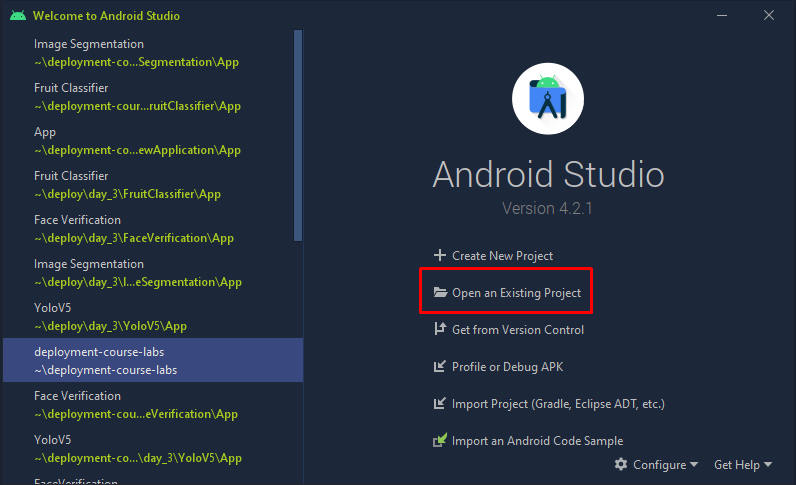

Step 3. Select `day_3/{ApplicationDirectory}/App` and click `OK` to open the project.
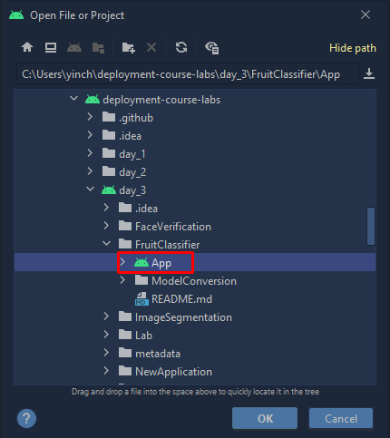

Step 4. Make sure the project view is set a `Android`.
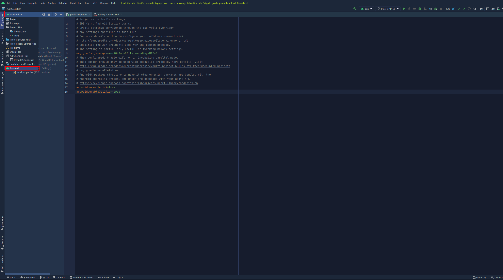

### Emulator Setup
Step 1. Open a project in Android Studio.

Step 2. In the navigation bar, click the `AVD Manager`.
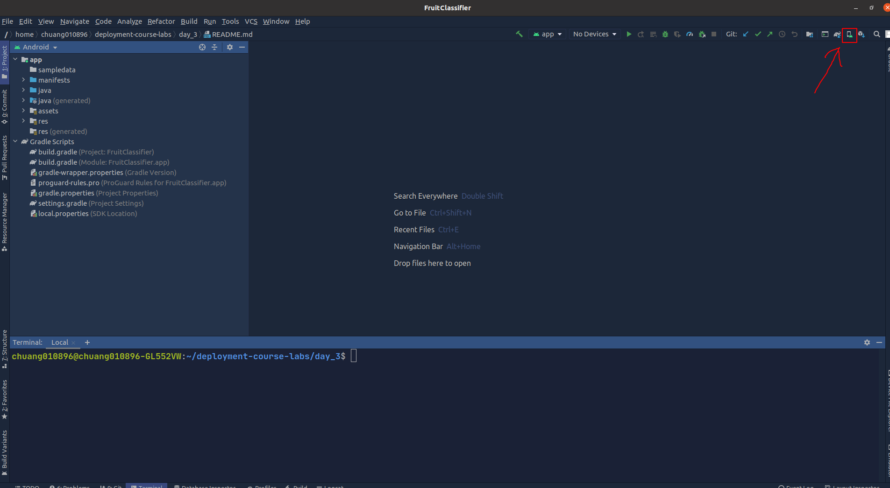

Step 3. In the `AVD Manager`, click the `Create Virtual Device` button.
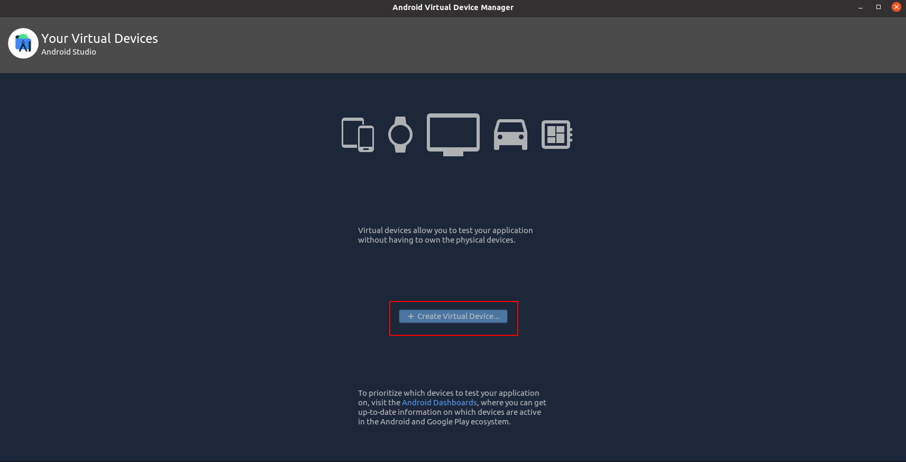

Step 4. In the `Virtual Device Configuration`, select any phone, then click next at the bottom right.
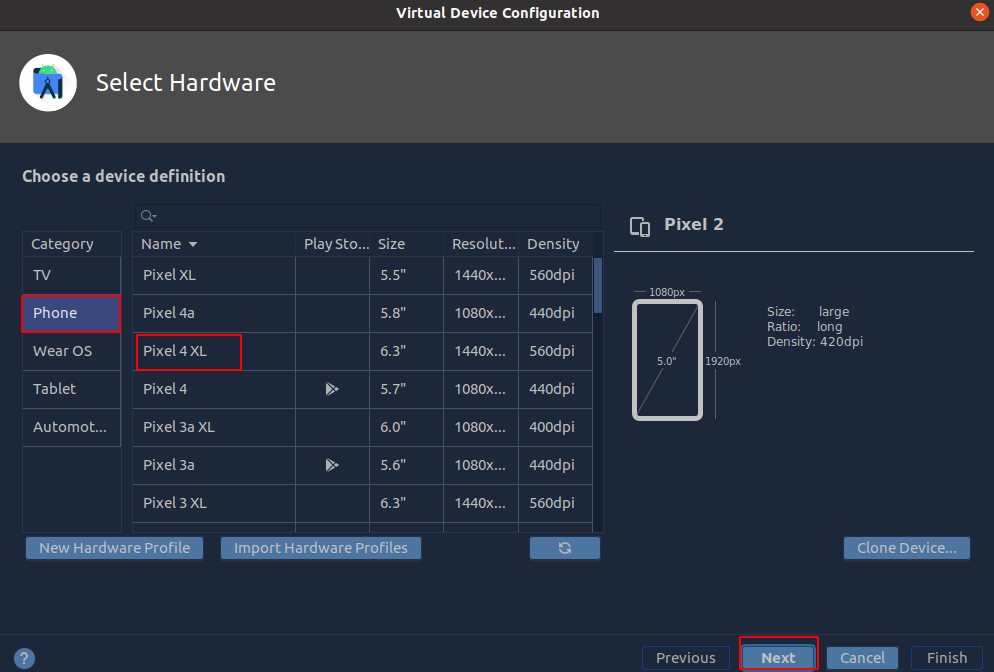

Step 5. For system image selection, select Android 9.0 or 10.0, then click next.
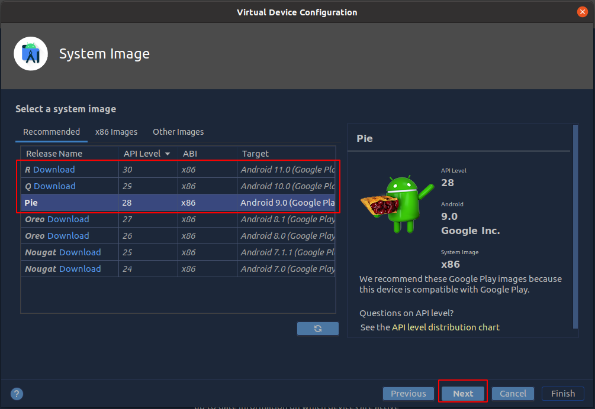

Step 6. In the configuration settings, make sure the `Startup orientation` is Portrait, then click `Show Advanced Settings`.
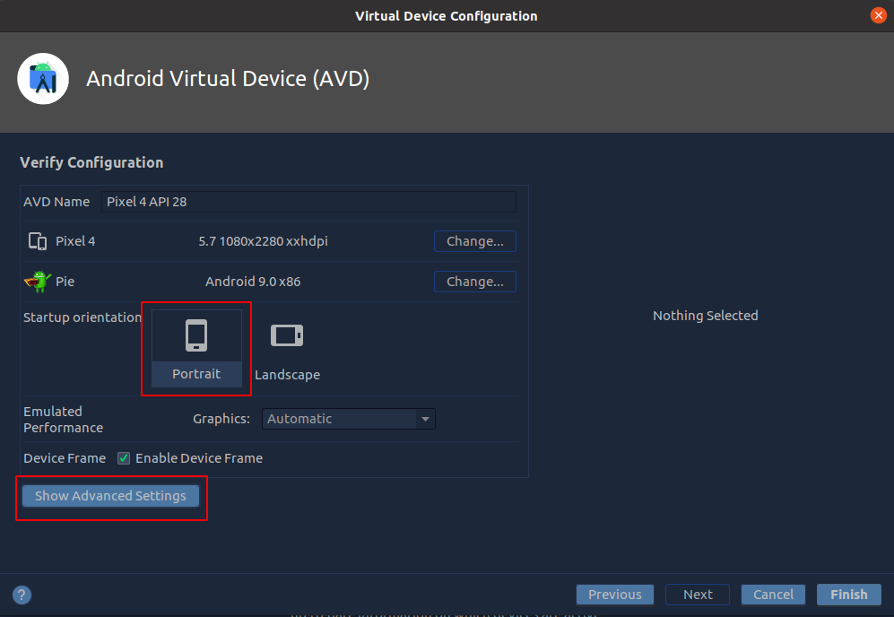

Step 7. In the camera settings, change the back camera to `Webcam0`, then click `Finish`.
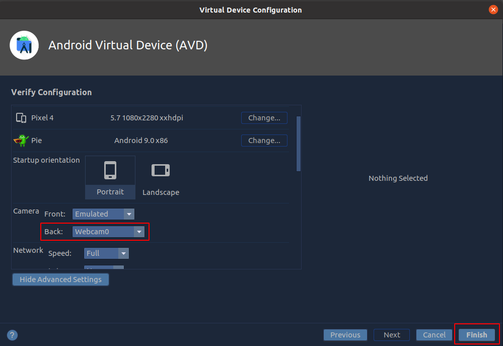

### Phone Setup
Step 1. Follow instruction from [here](https://developer.android.com/studio/debug/dev-options) to enable **developer option** and enable **USB debugging** in your phone.

Step 2. Connect your phone to the pc via USB.\
You should be able to see your phone is shown in the devices.
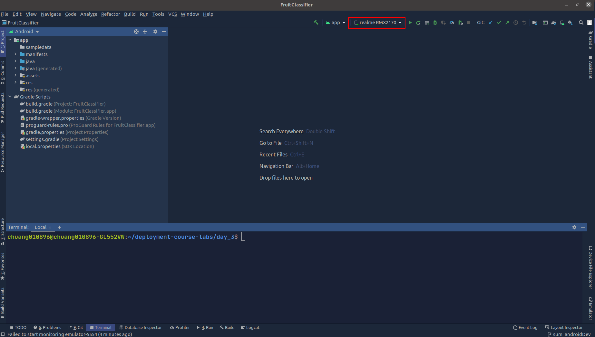

### Application Running
Step 1. In the navigation bar, make sure the running app and device are not empty.
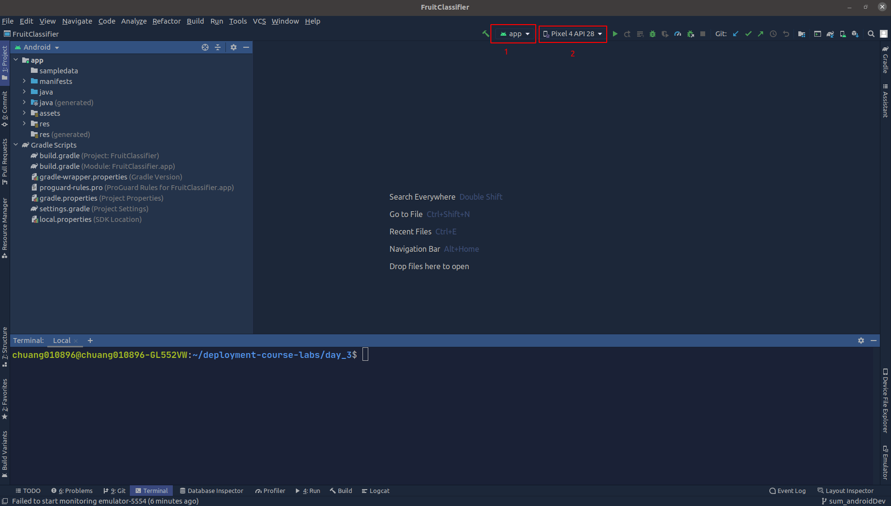

Step 2. Click the `Run 'app'` button
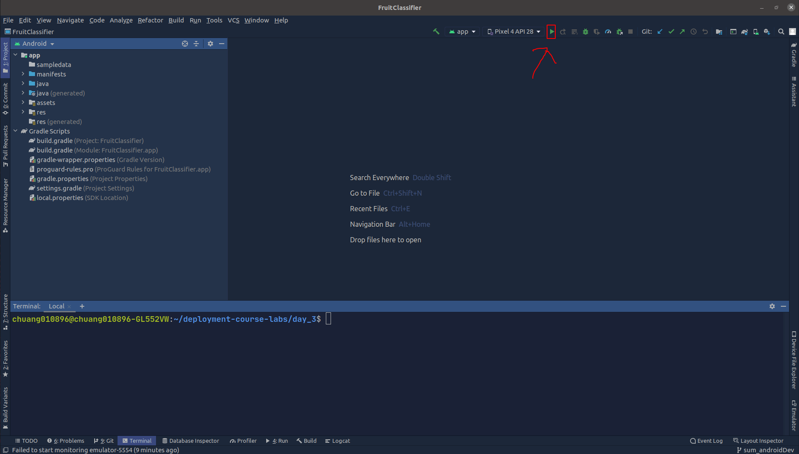

If you are using emulator, you will be able to see an emulator is running in your pc. Else, you will see the application is running in your phone.

